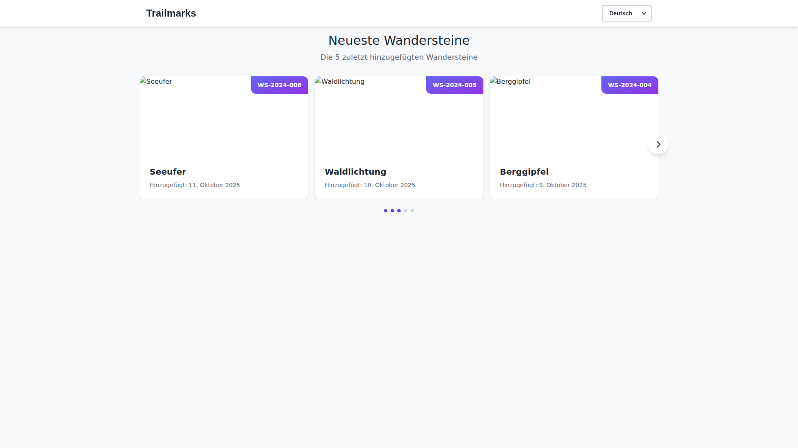
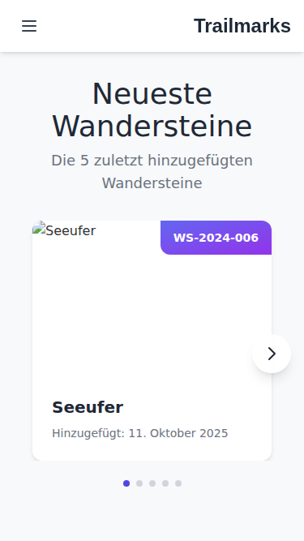
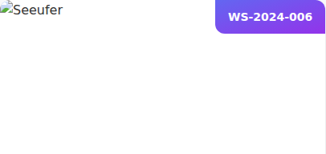
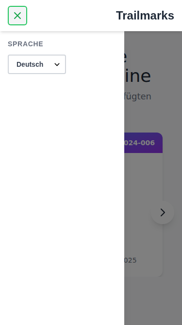
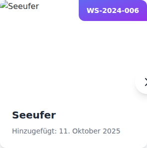

= Trailmarks - User Guide
:toc: left
:toclevels: 3
:sectnums:
:icons: font
:source-highlighter: highlightjs

== Introduction

Welcome to Trailmarks, your digital companion for discovering hiking stones (Wandersteine). This guide will help you get started with using the application.

[NOTE]
====
This user guide includes screenshots of the application to help visualize features and make the guide more accessible. Screenshots show both desktop and mobile views of the application.
====

=== What is Trailmarks?

Trailmarks is a web application that allows you to:

* View recently added hiking stones
* Browse information about hiking stones
* Access hiking stone details including location and images
* Switch between German and English languages

=== Who is this guide for?

This guide is for hikers, outdoor enthusiasts, and anyone interested in discovering hiking stones along trails.

== Getting Started

=== Accessing the Application

==== Web Browser

Open your web browser and navigate to the Trailmarks application:

* **Production**: https://trailmarks.io
* **Local Development**: http://localhost:4200

[NOTE]
====
The application works best on modern web browsers such as Chrome, Firefox, Safari, or Edge.
====

==== Mobile Access

Trailmarks is fully responsive and optimized for mobile devices:

1. Open your mobile web browser
2. Navigate to the Trailmarks URL
3. For easy access, you can add the page to your home screen:
   * **iOS**: Tap the Share button and select "Add to Home Screen"
   * **Android**: Tap the menu button and select "Add to Home Screen"

=== First Visit

When you first visit Trailmarks, you'll see:

* A welcome page with the 5 most recently added hiking stones
* A language switcher in the top-right corner
* A carousel displaying hiking stone preview images

.Homepage on desktop showing header with logo and language switcher, title, and carousel with hiking stones

.Homepage on mobile device showing responsive single-column layout

== Using Trailmarks

=== Viewing Recent Hiking Stones

The main page displays the 5 most recently added hiking stones.

.Hiking stone card showing preview image, name, unique ID, and date added

==== Information Displayed

For each hiking stone, you'll see:

* **Preview Image**: A photo of the hiking stone
* **Name**: The name of the hiking stone
* **Unique ID**: A unique identifier (e.g., WS-2024-001)
* **Date Added**: When the hiking stone was added to the database

==== Carousel Navigation

Navigate through hiking stones using the carousel:

* **Next/Previous Buttons**: Click the arrows on either side to browse
* **Swipe Gestures**: On mobile devices, swipe left or right
* **Automatic Scrolling**: The carousel will automatically advance every few seconds

.Carousel with navigation arrows and pagination indicators

=== Changing Language

Trailmarks supports multiple languages for your convenience.

==== Available Languages

* 🇩🇪 **German (Deutsch)**: Default language
* 🇬🇧 **English**: Alternative language

==== How to Change Language

1. Look for the language switcher in the top-right corner of the page
2. Click on the language dropdown
3. Select your preferred language
4. The page will immediately update to show content in the selected language

.Language switcher dropdown in desktop header

.Language switcher in mobile side navigation

[TIP]
====
Your language preference is saved in your browser and will be remembered on your next visit.
====

=== Understanding Hiking Stone Information

==== Unique ID

Each hiking stone has a unique identifier in the format `WS-YYYY-NNN`:

* `WS`: Wanderstein (Hiking Stone)
* `YYYY`: Year
* `NNN`: Sequential number

Example: `WS-2024-001` is the first hiking stone registered in 2024.

==== Preview Images

Images show the hiking stone in its natural environment. They help you:

* Identify the stone when hiking
* Understand the stone's appearance and setting
* Plan your hiking routes

==== Location Information

Location details help you find the hiking stone:

* Geographic location
* Nearby landmarks
* Trail information

== Mobile Features

=== Responsive Design

The application automatically adapts to your device:

* **Desktop**: Full layout with larger images and detailed information
* **Tablet**: Optimized layout for medium-sized screens
* **Mobile**: Compact layout perfect for on-the-go viewing

=== Touch Gestures

On mobile devices, you can:

* **Swipe**: Navigate through the carousel
* **Tap**: Select hiking stones for more details
* **Pinch to Zoom**: View images in detail (browser feature)

.Mobile burger menu button

.Mobile side navigation panel open

.Mobile carousel view

=== Offline Considerations

[CAUTION]
====
Trailmarks requires an internet connection to load hiking stone data. Make sure you have connectivity when using the app in remote areas.
====

== Troubleshooting

=== Common Issues

==== Page Not Loading

**Problem**: The page doesn't load or shows an error.

**Solutions**:

1. Check your internet connection
2. Refresh the page (F5 or Cmd+R)
3. Clear your browser cache
4. Try a different browser

==== Images Not Appearing

**Problem**: Hiking stone images don't display.

**Solutions**:

1. Check your internet connection
2. Wait a moment for images to load
3. Refresh the page
4. Check if images are blocked by browser extensions

==== Language Not Switching

**Problem**: The language doesn't change when selected.

**Solutions**:

1. Refresh the page
2. Clear browser localStorage
3. Check browser console for errors

==== Mobile Display Issues

**Problem**: The application doesn't display correctly on mobile.

**Solutions**:

1. Rotate your device to refresh the layout
2. Zoom out if the page appears too large
3. Update your mobile browser to the latest version

=== Getting Help

If you encounter issues not covered in this guide:

1. Check the application's health status at `/health` endpoint
2. Contact the system administrator
3. Report the issue through the appropriate channels

== Tips and Best Practices

=== For Best Experience

* **Use Modern Browsers**: Chrome, Firefox, Safari, or Edge
* **Keep Browser Updated**: Ensure you're using the latest version
* **Stable Connection**: Use a reliable internet connection
* **Mobile Data**: Be aware of data usage when viewing images on mobile networks

=== Accessibility

Trailmarks strives to be accessible:

* Clear, readable text
* High contrast between text and background
* Keyboard navigation support
* Screen reader friendly structure

=== Privacy

* Your language preference is stored locally in your browser
* No personal data is collected without your consent
* Browsing history is not tracked

== Frequently Asked Questions

=== General Questions

**Q: Is Trailmarks free to use?**

A: Yes, Trailmarks is freely accessible to all users.

**Q: Do I need to create an account?**

A: No, viewing hiking stones does not require an account.

**Q: How often is the data updated?**

A: Hiking stones are added regularly. Check the "Recent" page for the latest additions.

**Q: Can I suggest new hiking stones to add?**

A: Contact the administrators or moderators with your suggestions.

=== Technical Questions

**Q: What browsers are supported?**

A: All modern browsers including Chrome, Firefox, Safari, and Edge are supported.

**Q: Does the app work offline?**

A: No, an internet connection is required to load hiking stone data.

**Q: Why do some images load slowly?**

A: Image loading speed depends on your internet connection and the image file sizes.

**Q: Can I download hiking stone images?**

A: Right-click on images and select "Save Image As" (browser-dependent).

=== Language Questions

**Q: Can I add more languages?**

A: Additional languages may be added by administrators. Contact them with requests.

**Q: Why isn't my language available?**

A: Currently, only German and English are supported. More languages may be added in the future.

**Q: Can I help with translations?**

A: Yes! Contact the moderators if you'd like to contribute translations.

== Glossary

[cols="1,3"]
|===
|Term |Definition

|Wanderstein
|A hiking stone - a physical marker or memorial stone found along hiking trails

|Preview Image
|A photograph showing the hiking stone

|Unique ID
|A unique identifier for each hiking stone (e.g., WS-2024-001)

|Carousel
|A rotating display of images that can be navigated

|Responsive Design
|Web design that adapts to different screen sizes

|localStorage
|Browser storage mechanism for saving preferences locally
|===

== Appendix

=== Keyboard Shortcuts

[cols="1,2"]
|===
|Shortcut |Action

|F5 / Cmd+R
|Refresh page

|Ctrl+F / Cmd+F
|Search in page

|Tab
|Navigate between elements

|Arrow Keys
|Navigate carousel (when focused)
|===

=== Browser Compatibility

[cols="1,1"]
|===
|Browser |Minimum Version

|Chrome
|90+

|Firefox
|88+

|Safari
|14+

|Edge
|90+
|===

=== Contact Information

For questions, support, or feedback:

* **Email**: support@trailmarks.io
* **Website**: https://www.trailmarks.io
* **Documentation**: https://docs.trailmarks.io
